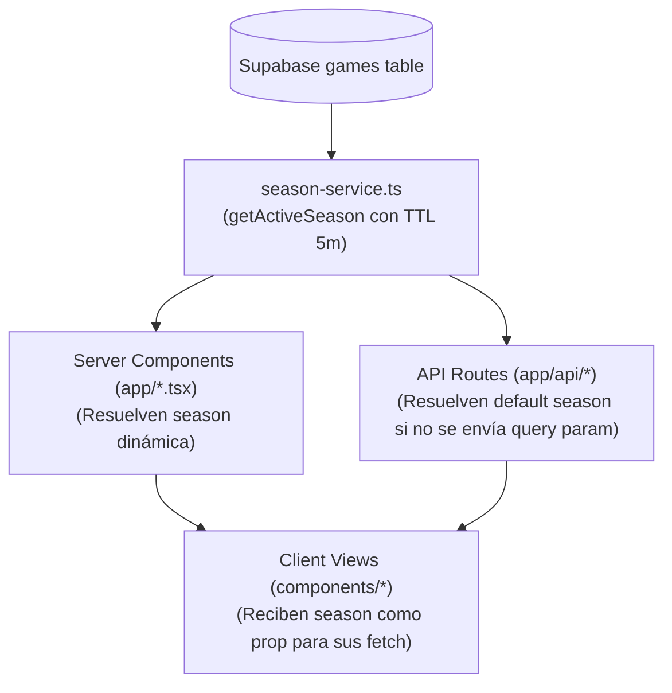

# Technical Plan: Detección Automática de Temporada Activa & Transición Cero-Mantenimiento

**Identificador**: `temporada-activa-automatica`  
**Objetivo**: Implementar la capa de resolución dinámica de temporada en Supabase y sincronizar todas las páginas, APIs y componentes.

---

## 1. Arquitectura Técnica

### 1.1 Módulo Central: `src/lib/season-service.ts`
- Encapsula la lógica de verificación en Supabase:
  - Cache en memoria con TTL de 300 segundos.
  - Consulta `MAX(season)` sobre partidos con estado finalizado o en vivo.
  - Fallback defensivo a `2025` si no hay conexión o no hay partidos nuevos aún.
  - Método `getAvailableSeasons()` para descubrir dinámicamente el catálogo de zafras disputadas.

### 1.2 Adaptación de API Routes
- En `/api/stats/batting`, `/api/stats/pitching`, `/api/stats/player-splits`, `/api/games`, `/api/standings`, `/api/kpis`:
  - `const season = searchParams.get("season") ? parseInt(searchParams.get("season")!, 10) : await getActiveSeason();`

### 1.3 Adaptación de Páginas Servidoras & Vistas Cliente
- Inyección de `season` resuelta en `IndividualesPage`, `HomePage`, `StandingsPage`, `BullpenPage`, etc.
- Reemplazo de cadenas `2025` quemadas en llamadas `fetch` de los componentes cliente.

---

## 2. Fases de Implementación

1. **Fase 1: Motor de Temporada**: Crear `src/lib/season-service.ts` y exportar helpers.
2. **Fase 2: APIs Autónomas**: Actualizar endpoints en `src/app/api/` para resolver `await getActiveSeason()`.
3. **Fase 3: Páginas Servidoras**: Sincronizar Server Components en `src/app/` pasando la temporada resuelta a las vistas.
4. **Fase 4: Limpieza de Componentes Cliente**: Eliminar cualquier hardcode `2025` residual en `src/components/`.
5. **Fase 5: Verificación & Despliegue**: Compilación estricta con Next.js 16 (Turbopack) y despliegue a producción.
