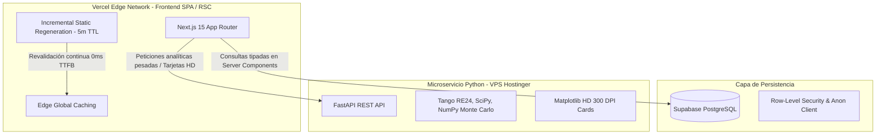

# República Caraquista Web 🦁⚾

> **Plataforma web sabermétrica moderna de alto rendimiento para la Liga Venezolana de Béisbol Profesional (LVBP), con enfoque analítico en los Leones del Caracas.**

Construida con **Next.js 15 (App Router, Turbopack, React 19)**, **TypeScript**, **Tailwind CSS** y **Supabase**, optimizada para despliegue global de baja latencia en la red Edge de **Vercel**.

---

## 🌟 Visión Arquitectónica

El proyecto implementa una **arquitectura híbrida desacoplada**:



- **Frontend en Vercel:** Carga instantánea con React Server Components (RSC) e Incremental Static Regeneration (ISR).
- **Persistencia en Supabase:** Acceso directo y seguro con claves anónimas a la base de datos oficial compartida de juegos y alineaciones.
- **Microservicio Analítico en VPS:** Soporte opcional para generación de tarjetas panorámicas HD a 300 DPI y simulaciones Monte Carlo sin límites serverless.

---

## 🚀 Módulos y Vistas (Fase 1 / MVP)

### 1. Centro de Mando (`/`)
- **Scoreboard Cara a Cara:** Últimos resultados y pizarras de juego de la temporada con escudos oficiales transparentes vía CDN de MLB.
- **Resumen de Temporada:** KPIs sabermétricos de los Leones del Caracas (Récord G-P, Porcentaje de Victorias, Posición en la tabla, Diferencial de Carreras y Racha actual).
- **Récord Día vs Noche:** Rendimiento del equipo según horario de juego (`is_day_game`).
- **Previa de Posiciones:** Vista rápida del Top 5 de clasificación.

### 2. Posiciones & ELO (`/standings`)
- **Tabla de Posiciones Oficial:** JJ, G, P, PCT, DIF, Carreras Anotadas (CA), Carreras Permitidas (CP), Diferencial (+/-), Casa, Visita, Racha y L10.
- **Expectativa Pitagórica ($xW$ / $xL$):** Proyección sabermétrica canónica de victorias basada en el diferencial de carreras con exponente $1.83$:
  $$xPCT = \frac{CA^{1.83}}{CA^{1.83} + CP^{1.83}}$$
### 3. Endpoints de la API REST (`/api/*`)
- **`GET /api/standings`**: Retorna la tabla de posiciones calculada a partir de los 224 juegos disputados en la temporada regular 2025. Parámetros opcionales: `season` (ej. 2025) y `phase` (`regular`, `round_robin`, `final`, `all`).
- **`GET /api/games`**: Retorna los marcadores y encuentros oficiales más recientes. Parámetros opcionales: `season` y `limit`.
- **`GET /api/kpis`**: Retorna el resumen de temporada sabermétrico de Leones del Caracas (W-L, racha, diferencial de carreras, récord Día vs Noche).

---

## 🗺️ Roadmap de Fases Siguientes

- [x] **Fase 1 (Completada):** Shell global de la app, tema Dark Navy (`#070B19`) & Oro (`#FDB827`), Centro de Mando (`/`), Posiciones & ELO (`/standings`) y despliegue en Vercel.
- [ ] **Fase 2:** Estadísticas Individuales de Bateo, Pitcheo y Fildeo (`/individuales`) con líderes sabermétricos (wOBA, wRC+, BABIP, FIP, WHIP).
- [ ] **Fase 3:** Comparador Head-to-Head **Matchup 360** (`/matchup`) con Radar Polar de 8 ejes sabermétricos y veredicto cuantitativo.
- [ ] **Fase 4:** Estadísticas Colectivas (`/colectivas`) y Analítica de Bullpen & Lineups (`/bullpen`).
- [ ] **Fase 5:** Motores avanzados: Win Expectancy & WPA (`/wpa`), Splits Situacionales & LOB Tracker (`/situacional`), Spray Charts determinísticos (`/spray-charts`).
- [ ] **Fase 6:** Pitching Summary & Telemetría (`/pitching`) con exportación de tarjetas HD a 300 DPI inspiradas en Thomas Nestico (@TJStats).

---

## 🛠️ Stack Tecnológico

| Capa | Tecnología |
| :--- | :--- |
| **Framework** | Next.js 15.x (App Router, Turbopack) |
| **Lenguaje** | TypeScript 5.x |
| **Estilos** | Tailwind CSS v4, Lucide React, Glassmorphism |
| **Base de Datos** | Supabase (PostgreSQL) |
| **Despliegue** | Vercel (Edge Network, Zero-Config CI/CD) |
| **Visualizaciones** | SVG, Recharts, Canvas nativo |

---

## 📦 Instalación y Desarrollo Local

### 1. Clonar el repositorio
```bash
git clone https://github.com/jloreto9/republicaraquista-web.git
cd republicaraquista-web
```

### 2. Configurar variables de entorno
Crea tu archivo `.env.local` basado en `.env.example`:
```bash
cp .env.example .env.local
```

Configura tus credenciales públicas de Supabase:
```ini
NEXT_PUBLIC_SUPABASE_URL=https://tu-proyecto.supabase.co
NEXT_PUBLIC_SUPABASE_ANON_KEY=tu-anon-key-de-supabase
```

### 3. Instalar dependencias
```bash
npm install
```

### 4. Iniciar servidor de desarrollo
```bash
npm run dev
```

Abre [http://localhost:3000](http://localhost:3000) en tu navegador.

### 5. Compilar para producción
```bash
npm run build
```

---

## 🚢 Despliegue en Vercel

1. Entra a [Vercel Dashboard](https://vercel.com/dashboard) y haz clic en **Add New... > Project**.
2. Importa el repositorio `jloreto9/republicaraquista-web`.
3. Configura las variables de entorno en la sección **Environment Variables**:
   - `NEXT_PUBLIC_SUPABASE_URL`
   - `NEXT_PUBLIC_SUPABASE_ANON_KEY`
4. Presiona **Deploy**. Vercel compilará la aplicación y la distribuirá globalmente con soporte de dominio personalizado y SSL automático.

---

## ⚖️ Convenciones y Licencia

- **Datos y CDN:** Estadísticas oficiales consumidas de MLB Stats API (`sportId=17`, `leagueId=135`) e imágenes de escudos oficiales desde `midfield.mlbstatic.com`.
- **Desarrollado por:** Jorge Leonardo Loreto • [República Caraquista](https://x.com/republicaraquista)
- **Licencia:** MIT
